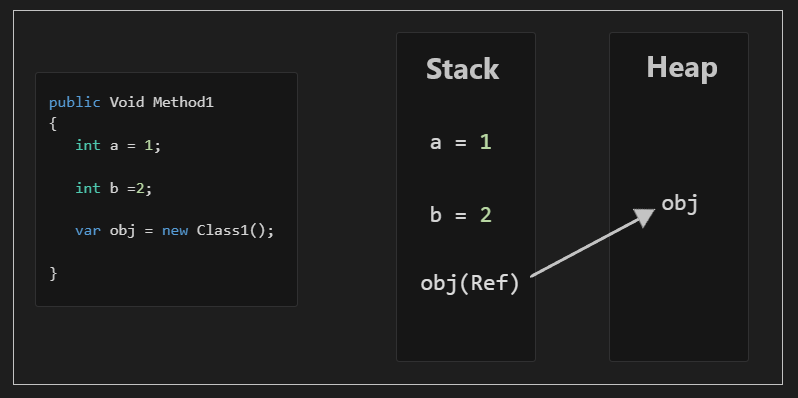

# C# Concepts and Key Features


- [What is **C#** and how does it differ from **.NET**?](#CSharp-VS-Net)
- [What is difference between **value type** and **reference type**?](#ValueType-VS-RefType)
- [What is **Boxing** and **Unboxing**?](#BoxingAndUnboxing)
- [What is difference between **Passing By Value** and **Passing By Reference**?](#PassingType)
- [What are **out**, **ref** and **in** keywords?](#OutRefIn)
- [What is the difference between **struct** and **class**?](#struct-VS-class)
- [What is difference between **constants** and **readonly** variables?](#Constants-VS-ReadOnly)
- [What is difference between **Properties** and **Fields**?](#Properties-VS-Fields)
- [What are **generics** and why are they useful?](#Generics)
- [What is the difference between **string** and **StringBuilder** ?](#String-VS-Stringbuilder)
- [What is **lambda expression**?](#LambdaExpression)
- [What Is **delegate**?](#Delegate-In-CSharp)
- [What Is **Action**, **Func**, and **Predicate**?](#Action-Func-Predicate)
- [What are **extension methods**?](#ExtensionMethods)
- [What the **IDisposable** interface and its purpose?](#IIDisposable-And-Purpose)
- [What is the purpose of the **using** statement?](#Using-In-CSharp)
- [What is the difference between  **++i** (pre-increment) **i++** (post-increment)?](#pre-post-increment)
- [What is the difference between **dynamic** and **object**?](#Dynamic-Object)
- [What is **Indexer**?](#Indexer)
- [What **params** modifier?](#params)
- [What is **tuple**?](#tuple)
- [What is **var** keyword?](#var)
- [What is **yield** keyword?](#yield)
- [What Are **Foreground** and **Background** threads?](#Foreground-Background-Threads)
- [What is the **ThreadPool**?](#ThreadPool)
- [What are **async/await**?](#async-await-In-CSharp)
- [What is a **Task**?](#Task)
- [What is the difference between **Task.Run** and **Thread.Start**?](#Task-vs-Thread)


## What is C# and how does it differ from .NET? <a id="CSharp-VS-Net"></a>
C# is a **language** used to write programs, while .NET is a **framework** that provides the environment and tools needed to run those programs. 

.NET supports other languages such as VB.NET and F#. 
 

## What is difference between **value type** and **reference type**?  <a id="ValueType-VS-RefType"></a>
| Feature                        | **Value Type**                                      | **Reference Type**                                 |
|---------------------------------|----------------------------------------------------|----------------------------------------------------|
| **Memory Location**             | Stored directly on the **stack**.                  | Stored on the **heap** with a reference (pointer) to the memory address on the stack. |
| **Copying Behavior**            | When assigned to another variable, a **copy of the value is made (two independent copies)**. | When assigned to another variable, a **copy of the reference (not the actual object) is made**, meaning both variables point to the same object. |
| **Nullability**                 | Cannot be `null` unless explicitly made nullable (e.g., `int?`). | Can be `null`, meaning it may not point to any object. |
| **Default Initialization**      | Default values are assigned (`0`, `false`, etc.).  | Default value is `null` (not pointing to any object). |
| **Examples**                    | Primitive types like `int`, `float`, `bool`, `struct`, `enum`. | Objects like `class`, `string`, `array`, `interface`, `delegate`. |

In summary:
- **Value types** store data directly and create independent copies when assigned.
- **Reference types** store references to objects in memory, so assigning one variable to another shares the same object.
  
<h2 dir="rtl" align="center">

   

</h2>


## What is **Boxing** and **Unboxing**? <a id="BoxingAndUnboxing"></a>
### **Boxing**:
- **Boxing** is the process of converting a **value type** (e.g., `int`, `bool`) into a **reference type** (i.e., `object` or an interface).
- Boxing occurs automatically (**implicit** cast).

### **Unboxing**:
- **Unboxing** is the process of converting a **reference type** (object) back to a **value type**.
- Requires an **explicit** cast.

### Example of Both:
```csharp
int num = 5; // value type
object obj = num; // boxing
int unboxedNum = (int)obj; // unboxing
```

## What is difference between **Passing By Value** and **Passing By Reference**?  <a id="PassingType"></a>
| **Feature**               | **Passing by Value**                       | **Passing by Reference**                    |
|---------------------------|--------------------------------------------|---------------------------------------------|
| **Behavior**               | A copy of the value is passed to the method | A reference to the original value is passed |
| **Effect on Original Data**| Changes inside the method do not affect the original variable | Changes inside the method affect the original variable |
| **Usage**                  | Default for value types                    | Use `ref` or `out` to pass by reference     |
| **Example**                | `ModifyValue(int x)`                       | `ModifyValue(ref int x)`   

## What are **out**, **ref** and **in** keywords? <a id="OutRefIn"></a>

In C#, the **out**, **ref**, and **in** keywords are used to pass arguments by reference to methods, but they have distinct behaviors


| Keyword | `ref`                                             | `out`                                        | `in`                                         |
|---------|--------------------------------------------------|---------------------------------------------|---------------------------------------------|
| Purpose | Passes by reference for both **read and write**  | Passes by reference for **output**         | Passes by reference for **read only**      |
| Condition | Must be initialized before being passed to the method. | Must be assigned a value in the method.    | Must be initialized before being passed to the method. |

[Ref, Out and In Examples](./RelatedDocuments/CSharp/RefOutIn.md)
            
## What is the difference between **struct** and **class**? <a id="struct-VS-class"></a>
| Feature               | **Class**                                               | **Struct**                                          |
|-----------------------|---------------------------------------------------------|-----------------------------------------------------|
| **Type**              | Reference type                                          | Value type                                          |
| **Memory Allocation** | Allocated on the heap                                   | Allocated on the stack                              |
| **Inheritance**       | Supports inheritance                                    | Does not support inheritance                        |
| **Default Constructor** | Can have a custom parameterless constructor (if explicitly defined)| Cannot define custom parameterless constructors (compiler provides one that initializes all fields) |
| **Use Cases**         | Ideal for complex data and objects with many fields     | Best for small, lightweight data structures that don't require inheritance |


### Examples

#### Class
```csharp
public class Car
{
    public string Make { get; set; }
    public string Model { get; set; }
}
```

#### Struct
```csharp
public struct Point
{
    public int X { get; set; }
    public int Y { get; set; }
}
```


## What is difference between **const** and **readonly** variables? <a id="Constants-VS-ReadOnly"></a>

| Feature               | **`const`**               | **`readonly`**      |
|-----------------------|--------------------------------------|------------------------------------------|
| **Declaration**       | `const` keyword                     | `readonly` keyword                      |
| **Initialization**    | Must be initialized at declaration  | Can be initialized at declaration or in the constructor |
| **Modifiable**        | Not modifiable after declaration    | Not modifiable after initialization     |
| **Value Set Time**    | Compile-time                        | Compile-time or Runtime (usually in the constructor)    |
| **can be declared inside the method**      | yes         | No     |
|**Can be used with static modifiers**|No (because const is implicit Static)|Yes|
| **Usage**             | Fixed values like `PI`, `MaxValue`  | Values set once, such as configuration data |
| **Examples**          | `public const int Max = 100;`       | `public readonly int Max;`<br>`Max = value;` |


## What is difference between **Properties** and **Fields**? <a id="Properties-VS-Fields"></a>
| Aspect | Properties | Fields |
|--------|------------|--------|
|Definition|Members that provide a flexible mechanism to read, write, or compute the value of a private field|Variables declared within a class to hold data|
| Syntax | Use get and set accessors | Declared as variables within a class |
| Encapsulation | Provide abstraction, hiding implementation details | If public, expose internal structure |
| Access Control | Can have different access levels for **get** and **set** | Single access modifier for the whole field |
| Validation | Can include logic to validate data | Only store data|
| Inheritance | Can be virtual and overridden | Cannot be overridden |
| Interfaces | Can be declared in interfaces | Cannot be declared in interfaces |

## What are generics and why are they useful? <a id="Generics"></a>
- Generic means not specific to a particular data type.
- Allows you to define classes, fields, methods, or interfaces **with type parameters** and this in turn improve code reusability.

### Example
[Using Example](./RelatedDocuments/CSharp/Generic.md) 

## What is the difference between **string** and **StringBuilder**? <a id="String-VS-Stringbuilder"></a>

| Feature                  | `string`                                   | `StringBuilder`                             |
|--------------------------|--------------------------------------------|--------------------------------------------|
| **Mutability**           | Immutable (Each modification creates a new string instance, which can lead to performance overhead) | Mutable (can be modified in place)        |
| **Performance**          | Less efficient for multiple modifications (creates new objects) | More efficient for frequent modifications  |
| **Memory Allocation**    | Creates new string instances on each change | Reuses memory, minimizing allocations       |
| **Usage Scenario**       | Best for Short strings, few modifications  | Best for Many modifications, especially in loops |
| **Example of Concatenation** | `result += "Hello";` (creates new string each time) | `sb.Append("Hello");` (appends without creating new objects) |


## What is **lambda expression**?<a id="LambdaExpression"></a>

A **lambda expression** in C# is a concise way to define anonymous functions (functions without a name) that can contain **expressions or statements**. It’s often used with **LINQ** and **delegates**, making code simpler and more readable.

**Key Points:**  
1. **Syntax**: The syntax of a lambda expression is `(input parameters) => expression or statements`.
2. **Usage**: Commonly used for short, inline functions with LINQ, and delegates.
3. **Readability**: Provides a clear, shorthand way to define functions, especially within collections or filtering.methods.

### Expression Lambda
Expression lambda contains a single expression after the `=>` symbol. It’s ideal for simple operations and directly returns the result of the expression.

```csharp
// Expression lambda to add two numbers
Func<int, int, int> add = (x, y) => x + y;
Console.WriteLine(add(3, 4)); // Output: 7
```

### Statement Lambda
```csharp
Func<int, int, int> multiplyOrAdd = (x, y) =>
{
    if (x > y)
        return x * y;
    else
        return x + y;
};
```

##  What Is **delegate**?<a id="Delegate-In-CSharp"></a>
A delegate in C# **is a type that represents a reference to a method**.   
It allows methods to be passed as parameters.   
Delegates can point to methods with a **matching signature** and **return type**.

## What Is **Action**, **Func**, and **Predicate**?<a id="Action-Func-Predicate"></a>
In C#, `Action`, `Func`, and `Predicate` are delegate types provided by the language to encapsulate method references.

### **Action<T1, T2, ...>:**

- `Action` is a **generic delegate type**, but it represents a method that takes parameters of types `T1, T2, ..., Tn` and does not **return a value (void)**.
- It can represent a method with up to 16 input parameters.

```csharp
// Represents an action that takes two integers and prints their sum
Action<int, int> printSumAction = (a, b) => Console.WriteLine(a + b);
printSumAction(3, 5); // Prints 8
```

### **Func<T1, T2, ..., TResult>:**

- `Func` is a **generic delegate type** that represents a method that takes parameters of types `T1, T2, ..., Tn` and **returns a result of type `TResult`**.
- Like `Action`, it can represent a method with up to 16 input parameters
- The last type parameter (`TResult`) represents the return type.

```csharp
// Represents a function that takes two integers and returns their sum
Func<int, int, int> addFunction = (a, b) => a + b;
int result = addFunction(3, 5); // return 8
```

### **Predicate <T>**

- `Predicate` is a **generic delegate type** that represents a method that takes **one input** parameter and **returns a Boolean value**.
- It has a single method signature `bool Predicate<T>(T obj)`.
- `Predicate<T>` is equivalent to `Func<T, bool>`.

```csharp
// Represents an action that takes an integer and checks even or not 
Predicate<int> isEven = x => x % 2 == 0;
isEven(2); //return true
```


## What are **extension methods**?<a id="ExtensionMethods"></a>
Extension methods in C# enable you to add methods to existing types without creating a new derived type or otherwise modifying the original type.

It allows you to create a more fluent syntax for function composition. 
### Syntax:
- Extension methods are declared as static methods in a static class.
- The first parameter in the method must include the this keyword followed by the type to be extended.


Here’s an example of how you can achieve this:  
[Extension Method Example](./RelatedDocuments/CSharp/ExtensionMethod.md)

## What the **IDisposable** interface and its purpose? <a id="IIDisposable-And-Purpose"></a>
### Definition
 **`IDisposable`** is an interface used to **release unmanaged resources** in a **deterministic way**.  
#### **Definition Breakdown**  
**Unmanaged resources:** Resources not managed by the CLR, such as file handles, database connections, and memory allocated through native code.   
**deterministic:** The **`Dispose`** method is called to explicitly clean up resources when an object is no longer needed

### Syntax
1. **Without Using**
   ```csharp
     var resource = new ResourceType();
     try
     {
        // Code that uses the resource
     }
     finally
     {
       resource.Dispose();
     }
    ```
  
2. **Wit Using**  
   **`using` statement** is used to ensure that `Dispose` is called automatically, improving code safety and readability.  

   ```csharp
      using (var resource = new ResourceType())
      {
       // Code that uses the resource
      }
       // The Dispose method is called automatically here
   ```


## What is the purpose of the **using** statement? <a id="Using-In-CSharp"></a>

The **`using` statement** in C# is primarily used for managing **resource disposal**. It ensures that unmanaged resources, such as file handles, network connections, or database connections, are properly released when they are no longer needed.   
The `using` statement provides a convenient way to work with objects that implement the **`IDisposable`** interface, automatically calling their `Dispose` method once the code block is exited, even if an exception occurs.

### **Purpose of `using` Statement**:
- **Automatic Resource Management**: Ensures that resources are properly disposed of without requiring explicit code to do so.
- **Simplifies Code**: Reduces boilerplate code for disposing of objects and handling exceptions.
- **Prevents Memory Leaks**: Guarantees that unmanaged resources are cleaned up, reducing the risk of memory leaks.

### **Syntax**:
```csharp
using (var resource = new ResourceType())
{
    // Code that uses the resource
}
// The Dispose method is called automatically here
```

In this context, **`ResourceType`** must implement the **`IDisposable`** interface. After the `using` block completes, the `Dispose` method is called automatically to release resources.

### Example
[Using Example](./RelatedDocuments/CSharp/Using.md) 


### **`using` Directive vs. `using` Statement**:
- **`using` Directive**: Used at the top of a C# file to **import namespaces** (e.g., `using System;`).
- **`using` Statement**: Used to **manage resources** within a block of code.

### Summary:
The `using` statement in C# is used for **automatic resource management**, ensuring that objects implementing the `IDisposable` interface are properly disposed of, helping to manage memory effectively and prevent resource leaks.


## What is the difference between  **++i** (pre-increment) **i++** (post-increment)? <a id="pre-post-increment"></a>

### 1. **Post-increment (`i++`)**  
The increment happens **after** the value is used in the expression.

#### Example:
```csharp
int i = 5;
int result = i++;  // result = 5, i becomes 6
```

### 2. **Pre-increment (`++i`)**
The increment happens **before** the value is used.

#### Example:
```csharp
int i = 5;
int result = ++i;  //  result = 6, i becomes 6,
```

## What is the difference between **dynamic**, and **object**?<a id="Dynamic-Object"></a>

In C#, both dynamic and object are used to represent types that can hold any data type, but they have key differences in behavior, usage, and purpose. Here’s a breakdown:

| Feature                | `dynamic`                 | `object`                         |
|------------------------|---------------------------|----------------------------------|
| **Definition**   | Runtime-bound type. The type is resolved at runtime. | Base type for all types in .NET,determined at compile time.|
| **Casting to retrieve the original type when accessing it** |**Require explicit casting** |**Not required**|
|**Compile-Time Checking**|**No** type checking|**Minimal** type checking (compiler only ensures it's a valid .NET type)|
| **Use Case**           | When working with dynamic data where the type is unknown at compile time, such as data from COM objects, reflection, or dynamic languages. | When you need a generic holder for data of any type with compile-time safety and casting. |
| **Example**            | `dynamic number = "1"; number = number + 1;` (works without explicit type conversion, but fails if the operation is invalid at runtime). | `object name = "Mohamed"; string strName = (string)name;` (explicit cast is needed to access string-specific operations). |

### Key Notes:
- **`dynamic`** is flexible but risky, as runtime errors can occur if the operations are invalid for the resolved type.
- **`object`** is the root type of all .NET types, often used in scenarios requiring general-purpose storage but less convenient due to casting requirements.


## What is Indexer? <a id="Indexer"></a>
An indexer in C# is a **special type of property that allows an object to be indexed**  
in the same way as an array using square brackets [].  
[Indexer Example](./RelatedDocuments/CSharp/Indexer.md) 

## What **params** modifier?<a id="params"></a>
The `params` modifier in C# allows you to pass a **variable number of arguments** to a method. It lets you define a method parameter that can accept **zero or more arguments** of a specified type, packed into an array.  
[Params Example](./RelatedDocuments/CSharp/Params.md) 


### Benefits:
- You can call the method with **any number of arguments**, or even none.
- The `params` modifier provides flexibility without requiring you to manually create an array each time.

### Key Restrictions:
- The `params` keyword **must be the last parameter** in the method signature.
- Only one `params` parameter is allowed per method.


## What is **tuple**?<a id="tuple"></a>


A **tuple** is a convenient way to **group multiple values in a lightweight data structure without defining a new class**.  
Tuples are useful for temporary data structures and methods that need to return multiple values.


### Basic Tuple
```csharp
// Creating a tuple with two elements
var person = Tuple.Create("Mohamed", 30);
Console.WriteLine(person.Item1); // Output: John
Console.WriteLine(person.Item2); // Output: 30
```

### Named Tuple (C# 7.0+)
```csharp
// Creating a named tuple
var employee = (Name: "Ahmed", Age: 25, Position: "Developer");
Console.WriteLine(employee.Name);   // Output: Alice
Console.WriteLine(employee.Age);    // Output: 25
Console.WriteLine(employee.Position); // Output: Developer
```
## What is **var** keyword? <a id="var"></a>
In C#, **`var`** is a keyword used to declare **implicitly typed local variables**, where the compiler infers the type of the variable based on the value assigned to it.

### Key Features of `var`:
1. **Type Inference**:  
   The type of the variable is determined at **compile time** by the compiler based on the assigned value.  
   ```csharp
   var name = "John"; // Compiler infers type as string
   var age = 30;      // Compiler infers type as int
   ```

2. **Strongly Typed**:  
   Once type is inferred, the type cannot change.  
   ```csharp
   var number = 10;   // Compiler infers int
   number = "text";   // Error: Cannot assign a string to an int
   ```

3. **Local Scope Only**:  
   `var` can only be used for local variables (inside methods, loops, etc.), not for class fields or properties.  
   ```csharp
   var localVariable = 50; // Valid
   // var globalField;      // Invalid for class-level fields
   ```

4. **Cannot Be Null Without Explicit Type**:  
   You cannot declare `var` with a `null` value unless explicitly typed (e.g., `var name = (string)null;`).

5. **Readability and Simplicity**:  
   Often used in situations where the type is either **obvious** or **complex** (e.g., LINQ queries).  
   ```csharp
   var result = from x in list where x > 5 select x; // Complex types
   ```


### When to Use `var`
1. When the type is **obvious** from the context:
   ```csharp
   var name = "John";  // string is obvious
   ```

2. When working with **anonymous types**:
   ```csharp
   var person = new { Name = "John", Age = 30 }; // Anonymous type
   ```

3. When the type is **long or complex** (e.g., LINQ queries):
   ```csharp
   var results = from item in collection where item.Age > 18 select item;
   ```


### When to Avoid `var`:
1. When it **reduces readability** or the type isn't obvious:
   ```csharp
   var x = GetData();  // What type is GetData() returning?
   ```

2. When explicitly specifying the type improves clarity for future maintenance.

In summary, `var` simplifies code while retaining strong typing but should be used carefully to maintain readability and clarity.

## What is **yield** keyword?<a id="yield"></a>
The `yield` keyword in C# is used to create iterator methods, which return sequences of values one at a time. These methods return `IEnumerable` or `IEnumerable<T>`and allow for efficient on-demand iteration.


### **How `yield` Works**
When you use `yield`, it pauses the execution of a method and remembers its state. The next time the enumerator is called, execution resumes from where it left off.


### **Key Features of `yield`:**
1. Simplifies code for generating sequences (e.g., custom iterators).
2. Defers execution until the values are actually iterated.
3. Reduces memory usage since the entire collection is not stored in memory at once.


### **When to Use `yield`:**
1. When generating large sequences lazily (e.g., reading lines from a file).
2. When you don’t need to store all items in memory at once.
3. When creating custom iteration logic.

### **`yield`** Examples
[Yield Example](./RelatedDocuments/CSharp/Yield.md) 

### **Advantages of `yield`:**
1. **Simpler Code:** Eliminates the need for manual implementation of enumerators.
2. **Lazy Evaluation:** Only generates the next value when needed.
3. **Efficient Memory Usage:** Does not allocate memory for the entire collection upfront.


### **Disadvantages of `yield`:**
1. Debugging can be slightly harder because of deferred execution.
2. State management within the iterator can be complex if the method has many variables.


## What Are **Foreground** and **Background** Threads?<a id="Foreground-Background-Threads"></a>
### Foreground threads
In C#, **foreground threads** are threads that run in the application and keep the application alive until they complete their execution. The application will not terminate until all foreground threads finish their work.

#### Key Points:
1. **Thread Behavior**: Foreground threads are the primary threads of execution in an application. The application will remain alive as long as there are any foreground threads running.
2. **Termination**: The program will not exit until all foreground threads have completed their execution.
3. **Use Case**: Typically used for critical tasks that must complete before the application terminates (e.g., main computation, UI interactions).

#### Example:
```csharp
Thread foregroundThread = new Thread(() =>
{
    // Some foreground work
    Console.WriteLine("Foreground thread running");
});
foregroundThread.IsBackground = false; // Default is foreground thread
foregroundThread.Start();
```

In the above example, if the foreground thread is running, the application will wait until it finishes its execution before it can exit.
### Background threads
In C#, **background threads** are threads that run in the background of your application. These threads are typically used **for tasks that should not block the main execution** of the program, such as performing lengthy computations or I/O operations.

#### Key Points:
1. **Thread Behavior**: Background threads run independently of the main thread (UI thread).
2. **Termination**: When all foreground threads (e.g., the main thread) finish, the runtime will automatically terminate any background threads, even if they haven't completed their work.
3. **Use Case**: Ideal for tasks that don’t need to keep the application running.

#### Example:
```csharp
Thread backgroundThread = new Thread(() =>
{
    // Some background work
    Console.WriteLine("Background thread running");
});
backgroundThread.IsBackground = true; // Set the thread as background
backgroundThread.Start();
```

**Note**: In a background thread, if the main thread finishes execution, the background thread will be forcefully terminated.

## What is the **ThreadPool**? <a id="ThreadPool"></a>
A **ThreadPool** in C# is a collection of worker threads that are managed and reused by the system for executing multiple tasks concurrently. Instead of creating a new thread every time a task is executed (which can be costly in terms of memory and performance), the **ThreadPool** reuses existing threads, making it more efficient.

### Key Points:
- **ThreadPool Threads**: Threads from the pool are typically background threads, meaning they don't prevent the application from exiting.
- **Limitations**: The number of threads in the pool is limited (though it can be expanded by the system).
- **Automatic Management**: The runtime manages thread lifecycle, including scaling up/down as needed.


### How it Works:
1. **Task Queue**: When a task is submitted to the ThreadPool, it is placed in a queue. 
2. **Worker Threads**: Worker threads are idle threads from the pool that pick up tasks from the queue and execute them.
3. **Thread Reuse**: After completing a task, a thread returns to the pool and is available for other tasks, avoiding the overhead of creating new threads.
4. **Thread Management**: The .NET runtime automatically manages the number of threads in the pool, dynamically adjusting based on workload and system resources.

This efficient way of handling tasks in a multithreaded environment helps reduce resource consumption and improves application responsiveness.

### Advantages:
- **Performance**: Reduces the overhead of creating and destroying threads.
- **Scalability**: Handles multiple tasks without the overhead of managing individual threads.
- **Efficient Resource Usage**: Limits the number of threads based on the system’s available resources.


### Example:
```csharp
using System;
using System.Threading;

class Program
{
    static void Main()
    {
        // Queue a task to the ThreadPool
        ThreadPool.QueueUserWorkItem(TaskMethod);
        
        // Wait for a key press to prevent immediate exit
        Console.ReadLine();
    }

    static void TaskMethod(object state)
    {
        Console.WriteLine("Task is being executed by a thread from the ThreadPool.");
    }
}
```

In the above example:
- `ThreadPool.QueueUserWorkItem` places a task in the ThreadPool queue.
- A worker thread from the pool picks up the task and executes it.

## What are **async/await**?<a id="async-await-In-CSharp"></a>
`async` and `await` are keywords in C# used to write **asynchronous** code.
They enable **non-blocking operations**, allowing the program to continue executing without waiting for a long-running task to complete.

`async`: Marks a method as **asynchronous** and indicates that it can contain `await` expressions.

`await`: Pauses the execution of the `async` method until the awaited task completes, **without blocking**.

### Example
[async/await Example](./RelatedDocuments/CSharp/AsyncAwait/AsyncAwait.md) 

## What is a **Task**?<a id="Task"></a>
In C#, a **Task** represents an asynchronous operation. It is used to run code in the background and allows for non-blocking execution. The Task class is part of the **System.Threading.Tasks** namespace and is commonly used with the async and await keywords to handle asynchronous methods. It can represent a computation that may or may not return a result and can be used to manage multiple operations running concurrently.

### Key Features of a Task:
- **Asynchronous Execution**: Allows for the execution of operations asynchronously, freeing up the main thread for other tasks.
- **Task Status**: A `Task` has various states, such as `Running`, `Completed`, `Faulted`, or `Canceled`, which can be monitored.
- **Return Values**: Tasks can return values via `Task<T>`, where `T` is the type of the result.
- **Continuation**: Tasks can continue executing other tasks after completion using methods like `ContinueWith`.

### Example of Task:
```csharp
using System;
using System.Threading.Tasks;

class Program
{
    static async Task Main(string[] args)
    {
        // Example of creating and running a Task asynchronously
        Task task = Task.Run(() => DoWork());
        await task;  // Wait for the task to complete

        Console.WriteLine("Task completed.");
    }

    static void DoWork()
    {
        Console.WriteLine("Work is being done on a separate thread.");
    }
}
```

#### Explanation:
- **Task.Run**: Creates and starts a new task. The action inside `Task.Run` will be executed asynchronously.
- **await task**: Ensures that the main thread waits for the asynchronous task to complete before continuing with other code.

### Task Types:
1. **`Task`**: Represents an operation that does not return a result (void-like).
2. **`Task<T>`**: Represents an operation that returns a result of type `T`.


### Task Methods:
- **`Task.WhenAny`**: Waits for any of the provided tasks to complete.
- **`Task.WhenAll`**: Waits for all of the provided tasks to complete.
- **`Task.Delay`**: Creates a task that completes after a specified delay (useful for simulating timeouts or delays in asynchronous methods).


## What is the difference between **Task.Run** and **Thread.Start**?<a id="Task-vs-Thread"></a>

| **Aspect**            | **Task.Run**                                                                 | **Thread.Start**                                                   |
|------------------------|------------------------------------------------------------------------------|----------------------------------------------------------------------|
| **Abstraction Level**  | High-level abstraction (part of Task Parallel Library - TPL).                | Low-level construct for directly managing threads.                  |
| **Ease of Use**        | Easier to use, integrates well with `async/await`.                          | Requires manual thread management.                                  |
| **Performance**        | Uses Thread Pool (efficient thread reuse).                                  | Creates a new OS thread each time (more resource-intensive).         |
| **Return Type**        | Returns a `Task`, supports results, chaining, and exception handling.        | Returns `void`, no direct support for results or exceptions.         |
| **Use Cases**          | Best for CPU-bound or asynchronous work, with chaining or awaiting results. | Suitable for long-running operations or low-level thread control.    |
| **Thread Management**  | Managed by the runtime, no need to manually manage lifecycle.                | Requires explicit thread lifecycle management.                       |

### Example Code:

| **Aspect**              | **Example Code**                                                                                                          |
|--------------------------|--------------------------------------------------------------------------------------------------------------------------|
| **Task.Run**            | `await Task.Run(() => { Console.WriteLine("Running with Task"); });`                                                      |
| **Thread.Start**        | `var thread = new Thread(() => { Console.WriteLine("Running with Thread"); }); thread.Start();`                           |


