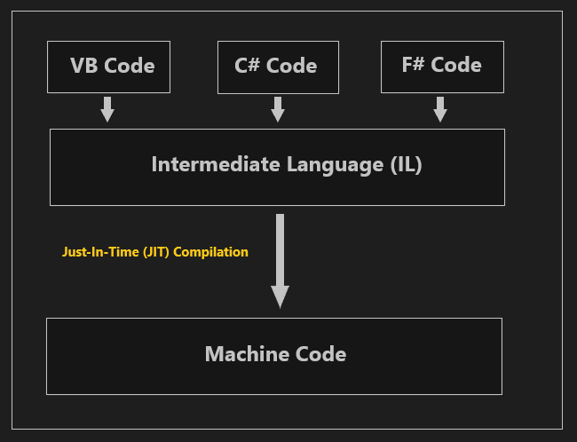

# .Net (General)


- [What is **Assembly**](#what-is-assembly)
- [What is **Intermediate Language (IL)**](#what-is-intermediate-language-il)
- [What is **CLR (Common Language Runtime)**](#what-is-clr-common-language-runtime)
- [What is **Just-In-Time (JIT) Compilation**](#what-is-just-in-time-jit-compilation)
- [What is **namespace**](#what-is-namespace)
- [What is **garbage collection**, and how does it work? Provide a code example of how you can enforce garbage collection.](#what-is-garbage-collection-and-how-does-it-work-provide-a-code-example-of-how-you-can-enforce-garbage-collection)
- [What are the differences between **Managed Resources** and **Unmanaged Resources**?](#what-are-the-differences-between-managed-resources-and-unmanaged-resources)
- [How to debug .NET Code?](#how-to-debug-net-code)


## What is Assembly?
An assembly is a compiled output (DLL or EXE) that serves as the fundamental unit of deployment, versioning, and execution in .NET.

For more detail: [Assembly](./RelatedDocuments/DotNetGeneral/Assembly.md)

## What is Intermediate Language (IL)?
Intermediate Language (IL), also referred to as Microsoft Intermediate Language (MSIL) or Common Intermediate Language (CIL), is a low-level, platform-independent programming language.

When you compile your .NET code (C# or other .NET languages), it doesn't compile directly into machine code. Instead, it compiles into IL, which is stored in assemblies (.dll or .exe).

IL is part of the Common Language Infrastructure (CLI), which allows .NET programs to be written in multiple languages (C#, VB.NET, F#, etc.) and run on different platforms.

## What is  CLR (Common Language Runtime)?
The CLR (Common Language Runtime) in .NET is the virtual machine component that manages the execution of .NET programs.

## What is Just-In-Time (JIT) Compilation? 
Just-In-Time (JIT) is the process where the Common Language Runtime (CLR) converts Intermediate Language (IL) code (contained in the assembly) into machine code at runtime, just before execution

The compilation happens at runtime, just before the method or code is executed, hence the name "just-in-time."


<p align="center">
    
</p>


## What is namespace?
is a way to organize and group related types (e.g., classes, interfaces, enums). It helps prevent 
naming conflicts by allowing the same class names to exist in different namespaces.

### Declaration of a Namespace:
```csharp
namespace MyApplication
{
}
```
### Using a Namespace:
To access classes from a different namespace, you use the **`using`** keyword:
```csharp
using MyApplication;
```

## What is **garbage collection**, and how does it work? Provide a code example of how you can enforce garbage collection.
Garbage Collection (GC) in .NET is an automatic memory management system that reclaims memory occupied by objects that are no longer in use, thus preventing memory leaks. It operates in the background, freeing up resources when objects are no longer reachable by any part of the application.

**How it works:**

- .NET uses a generational GC, which organizes objects into three generations: **Gen 0, Gen 1, and Gen 2**.  
- Objects in **Gen 0** are short-lived and collected frequently.   
- Surviving objects are promoted to **Gen 1** and eventually to **Gen 2** if they continue to survive collections.  
- GC is triggered when there’s insufficient memory in a generation, or explicitly by the developer.

**To enforce garbage collection in your code manually, you can run the following command (written in C#):**
```csharp
GC.Collect();
GC.WaitForPendingFinalizers();
```


## What are the differences between **Managed Resources** and **Unmanaged Resources**?

| **Aspect**              | **Managed Resources**                            | **Unmanaged Resources**                          |
|-------------------------|--------------------------------------------------|--------------------------------------------------|
| **Definition**          | Resources managed by the .NET runtime (CLR).    | Resources not managed by the CLR, such as File streams, database connections and network sockets. |
| **Memory Management**   |CLR handles allocation and deallocation via Garbage Collector (GC). | Must be explicitly released by the developer using `Dispose()`or finalizers to avoid memory leaks. |
| **Usage & Examples**            |Most C# objects (strings, lists, arrays).   | File streams, database connections, network sockets and COM objects. |


## How to debug .net code? 

### 1. Setting Breakpoints
A breakpoint is a marker you set on a line of code to pause execution when the program reaches that line

To set a breakpoint Click in the left margin of the code editor beside the line you want to break at, or press **F9**.

When the program hits a breakpoint, you can inspect the variables, navigate through code, and see the current state.

### 2. Step Over, Step Into, Step Out

**Step Over (F10):** Executes the current line of code. If the line contains a method call, it runs that method without step into it, moving to the next line 

**Step Into (F11):** Moves into the method call on the current line, allowing you to debug the code inside that method.

**Step Out (Shift + F11):** Executes the rest of the current function and returns to the caller, pausing at the  line that called the method.

### 3. Hover Tooltips
When you hover over a variable during debugging, a tooltip shows the current value of that variable, helping to quickly inspect values without opening other windows


### 4. Inspecting Variables
- **Locals Window:** Displays all local variables and their values in the current scope.
- **Watch Window:** Add specific variables or expressions to the Watch Window to monitor their values as you step through the code.


### 5. Quick Watch (Shift + F9)
- **Quick Watch (Shift + F9)** : Quick Watch is a feature in Visual Studio that allows you to quickly inspect the value of selected variable or expression during debugging without adding it permanently to the Watch Window.

### 6. Call Stack
The Call Stack window shows the series of method calls that led to the current point of execution. This is useful for understanding how your program reached a specific method.
Open it via Debug > Windows > Call Stack.

### 7. Immediate Window
The Immediate Window allows you to execute commands, check the values of variables, or even change variable values while the code is in break mode.
Open it via Debug > Windows > Immediate or by pressing Ctrl + Alt + I.

### 8. Edit and Continue
The Edit and Continue feature allows you to modify code during debugging without stopping your session.
Make changes to your code while paused at a breakpoint, and continue running to see how the changes affect execution.

### 9. Exception Handling and Debugging
Use try-catch blocks to handle exceptions and add breakpoints within catch blocks to inspect exceptions.

### 10. Debugging Multiple Threads
If you’re working with multithreaded code, you can use the Threads Window (Debug > Windows > Threads) to view and control the threads running in your application.
You can also freeze or thaw individual threads to help isolate concurrency issues.


